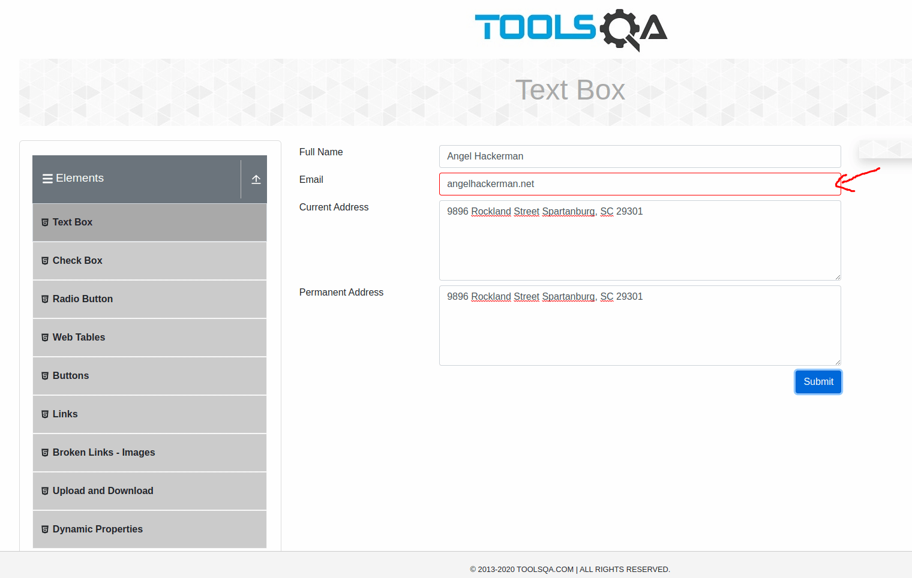
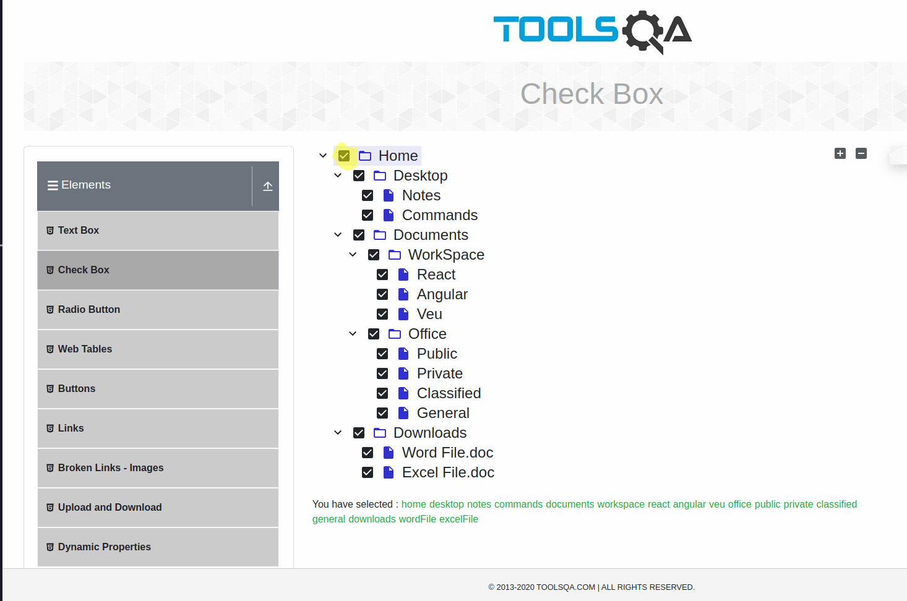

# DemoQa

> In this case we are about to **test several features** of the DemoQa page using **puppeteer**, features such as the elemets, forms, alerts, accordians and so many more.
**Object Under Test:** [https://demoqa.com/](https://demoqa.com/)

- Want to see the code? Click on the \_\_test\_\_ directory. 
- Want to see a video about how the automated test cases works? __Click here__ 
- If you want to read the test cases and check out the screenshots keep scrolling down 👇

  
<h1>Test Plan for DemoQA</h1>

  **Objective:** The objective of this test plan is to validate the functionality and usability of the interactive elements on the QA demonstration webpage.

**Scope:** This test plan covers the following elements on the webpage:

- Elements
- Forms
- Alerts, Frame & Windows
- Widgets
- Interactions
- Book Store Application

**Approach:** Each of the above elements will be tested individually to ensure they function as expected. Automated tests using Puppeteer will be used to simulate user interaction with these elements, using desktop and mobile views.

**Test Strategy:**

1. **Elements:** Verify that all elements (buttons, text boxes, etc.) load correctly and respond to user interaction as expected.
2. **Forms:** Verify that forms accept user input and process it correctly. This includes input validation and verifying that success/error messages are displayed correctly.
3. **Alerts, Frame & Windows:** Verify that alerts display correctly and that frames and windows load and function as expected.
4. **Widgets:** Verify that widgets load correctly and function as expected.
5. **Interactions:** Verify that interactions (such as drag and drop) function correctly.
6. **Book Store Application:** Verify that the bookstore application loads correctly, that all links and buttons function as expected, and that the shopping cart functionality works correctly.

**Success Criteria:** Each of the above elements should function as expected with no errors. Any deviation from expected functionality will be considered a test failure.

**Schedule:** The tests will be performed in the following order: Elements, Forms, Alerts, Frame & Windows, Widgets, Interactions, Book Store Application. Each set of tests will be performed in a separate session to avoid interference between tests.

**Resources:** The tests will be performed using Puppeteer to automate user interactions. **A development environment with Node.js and Puppeteer installed will be required.**

**Risks:** The main risks to this test plan are changes to the QA demonstration webpage that could cause tests to fail. To mitigate this risk, the webpage will be reviewed before each test session to identify any changes that could affect the tests.

  
<h1>Test Cases For The Elements Section</h1>

  

    
<h3>Test Case 1: Text Box</h3>

  **Test Objective:** Verify that the text box accepts user input and displays the results correctly.

  **Steps to Follow (Manual Testing):**

  1. Open the webpage **[https://demoqa.com/text-box](https://demoqa.com/text-box)** in a browser.
  2. Enter a name into the "Full Name" field. e.g. __"Angel Hackerman"__, __"Angel 1234" (numbers can also be included)__
  3. Enter an email into the "Email" field.
  4. Enter an address into the "Current Address" field. (9896 Rockland Street Spartanburg, SC 29301) 
  5. Enter another address into the "Permanent Address" field. (9896 Rockland Street Spartanburg, SC 29301)
  6. Click the "Submit" button.
  7. Verify that the results are displayed correctly under "Output".

  **Expected Outcome:** After clicking "Submit", the results should be displayed under "Output" and should match the data you entered into the form fields.

  <h4>Testing the happy path</h4>

  __Opening the page to test:__
  

  __Filling Out the form__
  

  __Output of the form__
  

  

    
<h4>Negative Test Case: Empty Fields</h4>

  **Test Objective:** Verify that the form does not accept submissions when all fields are left empty.

  **Steps to Follow (Manual Testing):**

  1. Open the webpage https://demoqa.com/text-box in a browser.
  2. Leave all the fields empty.
  3. Click the "Submit" button.
  4. Verify that below the form input there is not any return of any kind
  5. Expected Outcome: No error messages has to be shown, but nothing must change in the page

  

  

  
<h4>Negative Test Case: Incorrect Email Format</h4>

  **Test Objective:** Verify that the form does not accept submissions when the email is not in the correct format.

**Steps to Follow (Manual Testing):**

  1. Open the webpage https://demoqa.com/text-box in a browser.
  2. Enter a name into the "Full Name" field.
  3. Enter an incorrectly formatted email into the "Email" field (e.g., "test@com").
  4. Enter an address into the "Current Address" field. (9896 Rockland Street Spartanburg, SC 29301)
  5. Enter another address into the "Permanent Address" field.
  6. Click the "Submit" button.
  7. Verify that email field border has turn into red, indicating that the format is not valid 

  **Expected Outcome:** Email field border has turn into red, indicating that the format is not valid , and the form should not be submitted.

  

  

  

  
<h4>Edge Test Case: Not Mandatory Field</h4>

**Test Objective:** Verify that the form accepts submissions when one or more non-mandatory fields are left empty.

**Steps to Follow (Manual Testing):**

  1. Open the webpage https://demoqa.com/text-box in a browser.
  2. Enter a name into the "Full Name" field.
  3. Leave the "Email" field empty.
  4. Enter a valid "Current Address" value. (9896 Rockland Street Spartanburg, SC 29301)
  5. Leave the "Permanent Address" field empty.
  6. Click the "Submit" button.
  7. Verify that the form is submitted successfully and the results are displayed below.

**Expected Outcome:** The form is submitted successfully even with one or more non-mandatory fields left empty. The results displayed below the form\ should match the data entered into the form fields.

---

  

    
<h3> Test Case 2: Check Box</h3>

  
<h4>Happy Path Testing</h4>

  **Test Objective:** Verify that the checkboxes can be selected and unselected, and that the correct output is displayed when a checkbox is selected.

  **Steps to Follow (Manual Testing):**

  1. Open the webpage **[https://demoqa.com/checkbox](https://demoqa.com/checkbox)** in a browser.
  2. Click on the toggle on the left of the directory “Home”; Desktop, Documents, Downloads should be displayed now. 
  3. Click on the left toggles of each of those new directories, under Documents 2 new directories should be shown now: WorkSpace & Office. 
  4. Click on the left toggle of those directories: WorkSpace & Office. 
  5. Now select one by one the files: Notes, Commands, React, Angular, Veu, Public, Private, Classified, General, Word File.doc and Excel File.doc. All check box should be marked now **(CREATE A VALIDATION FOR THE “you have selected” SECTION)**. 
  6. Now unselect all the files by clicking on the check box of the parent directory “Home”, now all files should be unselected. 
  7. Collapse all directories by clicking on the toggle of the parent directories:  Desktop, Documents, Downloads and then collapse the directory Home.

  **Expected Outcome:** After clicking on a checkbox, it should be selected and the correct output should be displayed in the "Checked and unchecked" box. If the checkbox is clicked again, it should be unselected and the output should be updated accordingly.

  

  

  

  

  **Selecting all files and directories one by one:**

  

  

  
  

  
<h4>Edge Test Case: Reload the page while some checkboxes are selected</h4>

**Test Objective:** Verify that the checkboxes maintain their state after a page reload.

**Steps to Follow (Manual Testing):**

1. Open the webpage https://demoqa.com/checkbox in a browser.
2. Click on the toggle on the left of the directory “Home”; Desktop, Documents, Downloads should be displayed now.
3. Now select the directories Desktop, Documents and Downloads
4. After selecting those directories, reload the page.

**Expected Outcome:** The checkboxes that were selected before the page reload should should now be unselected.

**After refreshing the web page:**

<h4>Negative case, completing the missing selections</h4>

**Test Objective:** Verify that check all button works when some of the sections are selected. 

**Steps to Follow (Manual Testing):**

1. Open the webpage https://demoqa.com/checkbox in a browser.
2. Click on the toggle on the left of the directory “Home”; Desktop, Documents, Downloads should be displayed now, click on the toggle of them as well.
3. Select just some of the directories, not all of them. e.g: Commands, Angular, Classified and Excel file.doc
4. Click on the select button of the "Home" directory, selecting all the files and directories
5. Unselect the select button of the "Home" directory, now unselecting all the files and directories

**Expected Outcome:** When the select button of the "Home" directory is selected all the options should be marked, and when that button is unselected, all the options should be unselected. 

  

--- 

  

    
<h3>Test Case 3: Radio Button</h3>

  **Test Objective:** Verify that the radio buttons can be selected and that the correct output is displayed when a radio button is selected.

  **Steps to Follow (Manual Testing):**

  1. Open the webpage **[https://demoqa.com/radio-button](https://demoqa.com/radio-button)** in a browser.
  2. Click on a radio button “yes”.
  3. Verify that the radio button is selected.
  4. Verify that the correct output is displayed below the radio buttons.
  5. Click on a radio button “Impressive”.
  6. Verify that the radio button is selected.
  7. Verify that the correct output is displayed below the radio buttons.

  **Expected Outcome:** After clicking on a radio button, it should be selected and the correct output should be displayed below the radio buttons. If another radio button is clicked, it should become selected and the previous one should be deselected, and the output should be updated accordingly.

  

  

  
  

  

    
<h3>Test Case 4: Web Tables</h3>

  **Test Objective:** Verify that the web table displays the correct data and that the user can interact with the table as expected.

  **Steps to Follow (Manual Testing):**

  1. Open the webpage **[https://demoqa.com/webtables](https://demoqa.com/webtables)** in a browser.
  2. Verify that the table is displayed with the correct data.
  3. Click on the button “Delete” in the "Action" column for the first row (Cierra Vega) and verify that the row is removed. 
  4. Click on the button “Edit” in the "Action" column for the new first row (Kierra Gentry) and change the name to “Katrina” and her age is now “19”, click on submit button. Name has to be changed now to katrina with 19 years old
  5. Click on the “Add” button, fill out the first and last name with “Angel Hackerman”, email: angelhackerman@test.com, Age 27, salary 4000, department IT. Click on submit. A new row has to be created 
  6. In the input “type to search” type “Angel” and the new row created has to be displayed, make sure the first column if for “Angel Hackerman” 

  **Expected Outcome:** The table should display the correct data and the buttons in the "Action" column should function as expected. If there is an "Add" button, it should allow you to add a new row to the table, also we should be able to delete and edit the columns of the table. 

  

  

  

  

  

  

  

  
  

  

    
<h3>Test Case 5: Buttons</h3>

  **Test Objective:** Verify that the buttons on the page respond correctly to user interactions.

  **Steps to Follow (Manual Testing):**

  1. Open the webpage **[https://demoqa.com/buttons](https://demoqa.com/buttons)** in a browser.
  2. Right click on the "Right Click Me" button and verify that the correct message is displayed.
  3. Double click on the "Double Click Me" button and verify that the correct message is displayed.
  4. Click on the "Click Me" button and verify that the correct message is displayed.

  **Expected Outcome:** After interacting with each button, the correct message should be displayed below the button. The "Double Click Me" button should display a message about a double click, the "Right Click Me" button should display a message about a right click, and the "Click Me" button should display a message about a click.

  

  

  

  
  

  

    
<h3>Test Case 6: Links</h3>

  **Test Objective:** Verify that the links on the page respond correctly to user interactions and that the correct API status is received.

  **Steps to Follow (Manual Testing):**

  1. Open the webpage **[https://demoqa.com/links](https://demoqa.com/links)** in a browser.
  2. Click on “Home” and “HomeS9OAn” both should open a new tab and show you the home page. 
  3. Click on the "Created" link and verify that the correct API status is displayed.
  4. Repeat for the other links ("No Content", "Moved", "Bad Request", "Unauthorized", "Forbidden", "Not Found").

  **Expected Outcome:** After clicking on each link, the correct API status should be displayed. For example, after clicking on the "Created" link, the API status "201 Created" should be displayed.

  

  

  

  

  

  

  

  

  

  
  

  
<h1>Test Cases For: Form Section</h1>
 

 <h3>Test Case 1: Automation Practice Form</h3>

**Test Objective:** Verify that the form on the page can be filled out correctly and that the correct output is displayed when the form is submitted.

**Steps to Follow (Manual Testing):**

1. Open the webpage **https://demoqa.com/automation-practice-form** in a browser.
2. Enter a first name into the "First Name" field.
3. Enter a last name into the "Last Name" field.
4. Enter an email into the "Email" field.
5. Select a gender.
6. Enter a mobile number into the "Mobile Number" field.
7. Enter a subject into the "Subjects" field.
8. Select a hobby.
9. Enter an address into the "Current Address" field.
10. Select a state from the "State" dropdown.
11. Select a city from the "City" dropdown.
12. Click the "Submit" button.
13. Verify that the correct output is displayed.

**Expected Outcome:** After filling out the form and clicking "Submit", the correct output should be displayed. This output should match the data you entered into the form fields.

<h1>Test Cases For: Alerts, Frame & Windows</h1>

  

    
<h3>Test Case 1: Browser Windows</h3>

**Test Objective:** Verify that the buttons on the page open new browser windows or tabs as expected.

**Steps to Follow (Manual Testing):**
  1. Open the webpage **https://demoqa.com/browser-windows** in a browser.
  2. Click on the "New Tab" button and verify that a new tab opens.
  3. Switch to the new tab and verify that it has the correct content.
  4. Repeat for the "New Window" and "New Window Message" buttons.

**Expected Outcome:** After clicking on each button, a new browser window or tab should open with the correct content. The "New Tab" button should open a new tab, the "New Window" button should open a new window, and the "New Window Message" button should open a new window with a message.
  

  

    
<h3>Test Case 2: Browser Alerts</h3>

    
  **Test Objective:** Verify that the buttons on the page trigger the correct browser alerts and that the alerts display the correct messages.

  **Steps to Follow (Manual Testing):**

  1. Open the webpage **https://demoqa.com/alerts** in a browser.
  2. Click on the "Click me" button and verify that a browser alert appears.
  3. Verify that the alert displays the correct message.
  4. Dismiss the alert and verify that it closes correctly.
  5. Repeat for the other buttons alerts like the **5 seconds alert**.
  6. Click on the confirm box alert, once the alert is dismissed, make sure the confirmation message is shown.
  7. Click on the prompt box alert and write “Angel Hackerman”, and make sure the confirmation message says: “You entered Angel Hackerman”.

**Expected Outcome:** After clicking on each button, a browser alert should appear with the correct message. The alert should be dismissable and should close correctly when dismissed.
  

  

  
<h3>Test Case 3: Modal Dialogs</h3>

**Test Objective:** Verify that the buttons on the page open the correct modal dialogs and that the dialogs display the correct content.

**Steps to Follow (Manual Testing):**

1. Open the webpage **https://demoqa.com/modal-dialogs** in a browser.
2. Click on the "Small modal" button and verify that a small modal dialog appears with the correct content.
3. Close the small modal and verify that it closes correctly.
4. Click on the "Large modal" button and verify that a large modal dialog appears with the correct content.
5. Close the large modal and verify that it closes correctly.

**Expected Outcome:** After clicking on each button, a modal dialog should appear with the correct content. The "Small modal" button should open a small modal dialog, and the "Large modal" button should open a large modal dialog. When the modal is closed, it should disappear from the screen.
  

<h1>Test Caes For: Widgets</h1>

<h3>Test Case 1: Accordian</h3>

**Test Objective:** Verify that the accordion on the page functions correctly, expanding and collapsing sections as expected and displaying the correct content.

**Steps to Follow (Manual Testing):**

1. Open the webpage https://demoqa.com/accordian in a browser.
2. Click on the first section of the accordion ("What is Lorem Ipsum?") and verify that it expands to display the correct content.
3. Click on the first section again and verify that it collapses.
4. Repeat for the other sections of the accordion ("Where does it come from?" and "Why do we use it?").

**Expected Outcome:** After clicking on a section of the accordion, it should expand to display the correct content. When clicked again, it should collapse. The other sections should behave in the same way.

<h3>Test Case 2: Auto Complete</h3>

**Test Objective:** Verify that the autocomplete fields on the page function correctly, suggesting the correct options as the user types.

**Steps to Follow (Manual Testing):**

1. Open the webpage https://demoqa.com/auto-complete in a browser.
2. Click on the "Type multiple color names" field and start typing a color name.
3. type "r" and select "Green" from the dropdown options
4. Verify that the correct color names are suggested as you type.
5. Click on one of the suggested color names and verify that it is added to the field.
6. Repeat for the "Type single color name" field, e.g type "b" and select "black"

**Expected Outcome:** After typing into an autocomplete field, the correct color names should be suggested. When a suggested color name is clicked, it should be added to the field. The "Type multiple color names" field should allow multiple color names to be added, while the "Type single color name" field should only allow one.

<h3>Test Case 3: Date Picker</h3>

**Test Objective:** Verify that the date picker functions correctly, allowing the user to select a date and displaying the selected date correctly.

**Steps to Follow (Manual Testing):**

1. Open the webpage https://demoqa.com/date-picker in a browser.
2. Click on the date input to open the date picker.
3. Select the date 20 of November 2025
4. Verify that the selected date is displayed in the date input.
5. Click on the input of the Date and Time. 
6. Select 31 october 2028 with time at 3:00 PM
7. Verify that the selected date is displayed in the date input.

**Expected Outcome:** After selecting a date from the date picker, the selected date should be displayed in the date input. The format of the date should be "mm/dd/yyyy". In the Date And Time file the format will be: "MM/DD/YYYY HH:MM PM/AM"

<h3>Test Case 4: Slider</h3>

**Test Objective:** Verify that the slider functions correctly, allowing the user to adjust the value and displaying the adjusted value correctly.

**Steps to Follow (Manual Testing):**

1. Open the webpage https://demoqa.com/slider in a browser.
2. Adjust the slider to a specific value, 
first to __1__, then in other test to __99__, 
in otherone __101__ (expecting to fail),
and the last one to __-5__ (expecting to fail as well).
3. Verify that the adjusted value is displayed correctly.

**Expected Outcome:** After adjusting the slider, the adjusted value should be displayed correctly. The displayed value should match the position of the slider.

<h3>Test Case 5: Progress Bar</h3>

**Test Objective:** Verify that the progress bar functions correctly, filling up over time when the "Start" button is clicked and displaying the correct percentage.

**Steps to Follow (Manual Testing):**

1. Open the webpage https://demoqa.com/progress-bar in a browser.
2. Click the "Start" button and observe the progress bar, click again now in the "stop" button once the 45% is reached.
3. Then click again in the "Start" button and "Stop" it once the 80% is reached, click again in "Start".
4. Verify that the progress bar fills up over time and reaches 100%.
5. Click on "Reset" and make sure progress bar goes back to "empty"

**Expected Outcome:** After clicking the "Start" button, the progress bar should fill up over time. When it's fully filled, it should display "100%".

<h3>Test Case 6: Tabs</h3>

**Test Objective:** Verify that the tabs on the page function correctly, displaying the correct content when each tab is selected.

**Steps to Follow (Manual Testing):**

1. Open the webpage https://demoqa.com/tabs in a browser.
2. Click on the "What" tab and verify that the correct content is displayed.
3. Repeat for the "Origin" and "Use" tabs.

**Expected Outcome:** After clicking on a tab, the correct content should be displayed. The "What" tab should display content about what Lorem Ipsum is, the "Origin" tab should display content about the origin of Lorem Ipsum, and the "Use" tab should display content about the use of Lorem Ipsum.

<h3>Test Case 7: Tool tips (hover) </h3>

**Test Objective:** Verify that the tool tips function correctly, appearing when the user hovers over the specified elements and displaying the correct content.

**Steps to Follow (Manual Testing):**

1. Open the webpage https://demoqa.com/tool-tips in a browser.
2. Hover over the "Hover me to see" button and verify that a tool tip appears with the correct content.
3. Repeat for the "Hover me to see" input and the "Contrary" and "1.10.32" links.

**Expected Outcome:** After hovering over each specified element, a tool tip should appear with the correct content. The tool tip for the "Hover me to see" button should say "You hovered over the Button", the tool tip for the "Hover me to see" input should say "You hovered over the text field", and the tool tips for the "Contrary" and "1.10.32" links should say "You hovered over the Contrary" and "You hovered over the 1.10.32", respectively.

<h3>Test Case 8: Menu</h3>

**Test Objective:** Verify that the "Main Item 2" menu functions correctly, expanding and collapsing sections as expected and displaying the correct content.

**Steps to Follow (Manual Testing):**

1. Open the webpage in a browser.
2. Hover over the "Main Item 2" menu and verify that it expands to display the correct content.
3. Hover over the "SUB SUB LIST > SUB SUB ITEM 2" and verify that it is displayed correctly.

**Expected Outcome:** The "Main Item 2" menu should expand to display the correct content when hovered over. The "SUB SUB LIST > SUB SUB ITEM 2" should be displayed correctly when "Main Item 2" is expanded.

<h3>Test Case 9: Select Menu</h3>

**Test Objective:** Verify that the dropdown menus on the page function correctly, allowing the user to select options and displaying the selected options correctly.

**Steps to Follow (Manual Testing):**

Open the webpage https://demoqa.com/select-menu in a browser.
Click on the "Select Value" dropdown menu and select an option e.g. group 1, option2; group 2, option 1. Verify that the selected option is displayed correctly.
Repeat for the "Select One", and "Select Title" dropdown menus, e.g. Ms. Dr. Prof.
Click on the "Old Style Select Menu" dropdown menu, select a color, and verify that the selected color is displayed correctly.
Click on the "Multiselect drop down" menu, select one or more options, and verify that the selected options are displayed correctly.
Repeat for the "Standard multi select" dropdown menu.

